# Data Structures

****Data structures**** are the fundamental building blocks of computer programming. They define how data is organized, stored, and manipulated within a program.

## ****Classification of Data Structure:****

1.****Linear Data Structure****: Data structure in which data elements are arranged sequentially or linearly, where each element is attached to its previous and next adjacent elements, is called a linear data structure.  
****Example:**** Array, Stack, Queue, Linked List, etc.

2.****Non-Linear Data Structure:**** Data structures where data elements are not placed sequentially or linearly are called non-linear data structures. In a non-linear data structure, we can't traverse all the elements in a single run only.  
****Examples:**** Trees and Graphs.

## ****Most Popular Data Structures:****

1. [Array](#array)
2. [Linked List](#linked-list)
3. [Stack](#stack)
4. [Queue](#queue)
5. [Tree](#tree)

## Array

1.**Array**:An array is a collection of data items stored at contiguous memory locations. The idea is to store multiple items of the same type together.

## Complexity Analysis of Operations on Array

### Time Complexity

| Operation             | Worst Case |
| --------------------- | ---------- |
| ****Traversal****     | O(N)       |
| ****Append****        | O(1)       |
| ****Insert****        | O(N)       |
| ****Max****           | O(N)       |
| ****Min****           | O(N)       |
| ****Sum****           | O(N)       |
| ****Avg****           | O(N)       |
| ****Reverse****       | O(N)       |
| ****Expand****        | O(N)       |
| ****Deletion****      | O(N)       |
| ****Linear Search**** | O(N)       |
| ****Binary Search**** | O(log n)   |
| ****Sort****          | O($n^2$)   |
---

## Linked List

### What is a Linked List?

A ****linked list**** is a linear data structure that consists of a series of nodes connected by pointers. Each node contains ****data**** and a ****reference**** to the next node in the list.

### Linked List vs Array

| Array                               | Linked List                       |
| ----------------------------------- | --------------------------------- |
| Stored in contiguous location       | Not stored in contiguous location |
| Fixed size                          | Dynamic size                      |
| Memory is allocated at compile time | Memory is allocated at run time   |
| Use less memory                     | Use more memory                   |
| Insertion/Deletion: Inefficient     | Insertion/Deletion: Efficient     |
| Elements can be accessed easily     | Elements can be accessed slowly   |

### Types of Linked List

1. Singly Linked List
2. Doubly Linked List
3. Circular Linked List
4. Doubly Circular Linked List

## Complexity Analysis of Operations on Linked List

### Time Complexity

| Operation                | Worst Case |
| ------------------------ | ---------- |
| ****Traversal****        | O(N)       |
| ****Append****           | O(1)       |
| ****Insert Front****     | O(1)       |
| ****Insert****           | O(N)       |
| ****Reverse****          | O(N)       |
| ****Delete Beginning**** | O(1)       |
| ****Delete End****       | O(N)       |
| ****Deletion Middle****  | O(N)       |
| ****Linear Search****    | O(N)       |
---

## Stack

### What is a Stack?

A stack is a linear data structure that follows the Last-In-First-Out (LIFO) principle.

## Complexity Analysis of Operations on Stack

### Time Complexity

| Operation       | Worst Case |
| --------------- | ---------- |
| ****Push****    | O(1)       |
| ****Pop****     | O(1)       |
| ****Peek****    | O(1)       |
| ****IsEmpty**** | O(1)       |
| ****length****  | O(1)       |
| ****clear****   | O(n)       |
---

## Queue

### What is a Queue?

****Queue Data Structure**** is a linear data structure that is open at both ends and the operations are performed in First In First Out (FIFO) order.

## Complexity Analysis of Operations on Queue

### Time Complexity

| Operation       | Worst Case |
| --------------- | ---------- |
| ****Enqueue**** | O(1)       |
| ****Dequeue**** | O(1)       |
| ****Rear****    | O(1)       |
| ****Front****   | O(1)       |
| ****IsEmpty**** | O(1)       |
| ****length****  | O(1)       |
| ****clear****   | O(n)       |
---

## Tree

### What is a Tree Data Structure?

A ****tree data structure**** is a hierarchical structure that is used to represent and organize data in a way that is easy to navigate and search. It is a collection of nodes that are connected by edges and has a hierarchical relationship between the nodes.

### Terminologies In Tree Data Structure

- ****Root Node:**** The topmost node of a tree or the node which does not have any parent node is called the root node. A non-empty tree must contain exactly one root node and exactly one path from the root to all other nodes of the tree.
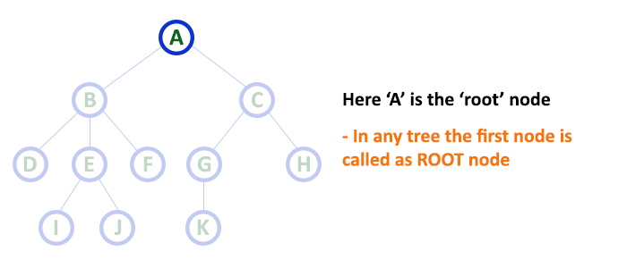
- ****Edge:**** The connecting link between any two nodes is called ****Edge****. In a tree with '**N**' number of nodes there will be a maximum of '**N-1**' number od edges.
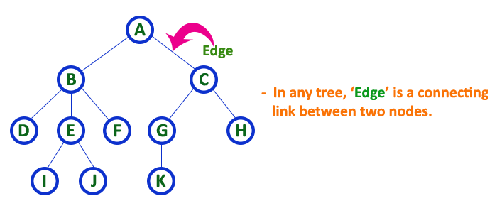
- ****Parent Node:**** The node which is a predecessor of a node is called the parent node of that node.
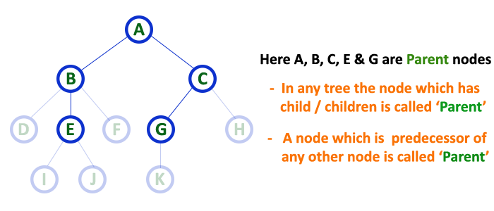
- ****Child Node:**** The node which is the immediate successor of a node is called the child node of that node.
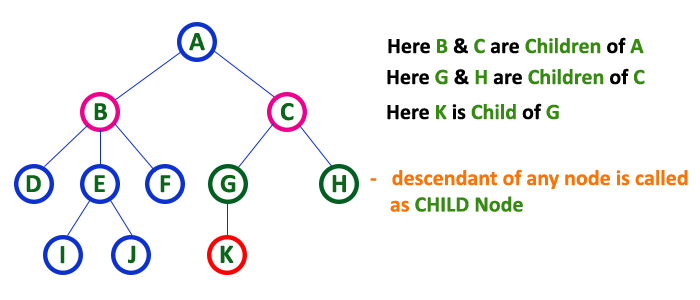
- ****Sibling:**** Children of the same parent node are called siblings.
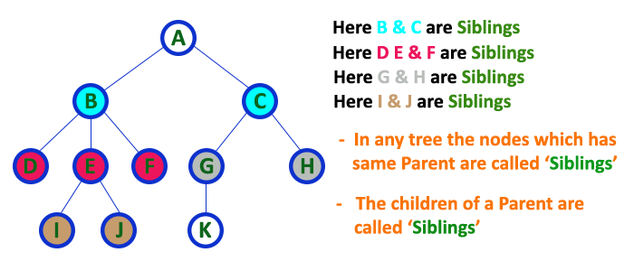
- ****Leaf Node or External Node:**** The nodes which do not have any child nodes are called leaf nodes.
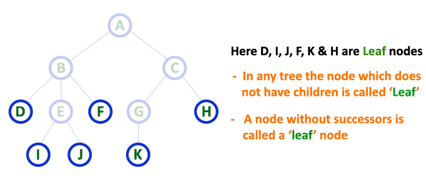
- ****Internal node:**** A node with at least one child is called Internal Node.
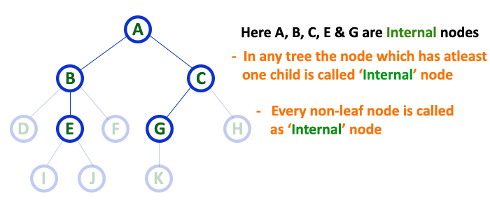
- ****Degree:**** The total number of childern of a nodes.
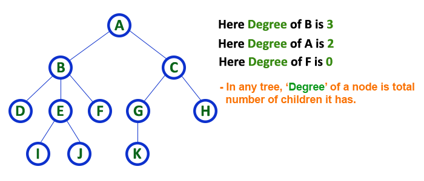
- ****Level of a node:**** The count of edges on the path from the root node to that node. The root node has level ****0****.
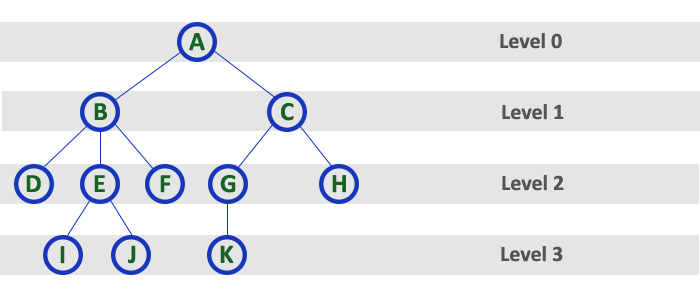
- ****Height:**** the total number of edges from leaf node to a particular node in the longest path is called as HEIGHT of that Node.
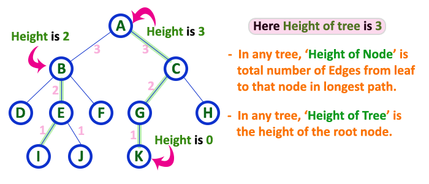
- ****Depth:**** the total number of egdes from root node to a particular node is called as DEPTH of that Node.
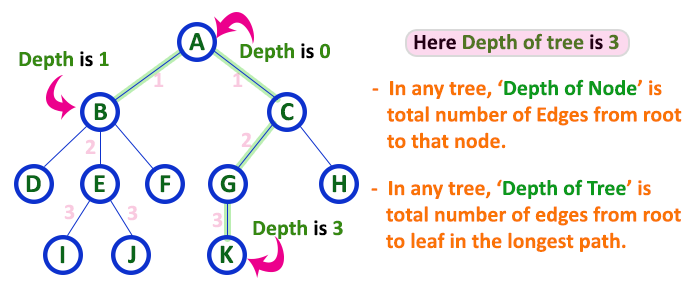
- ****Ancestor of a Node:**** Any predecessor nodes on the path of the root to that node are called Ancestors of that node.
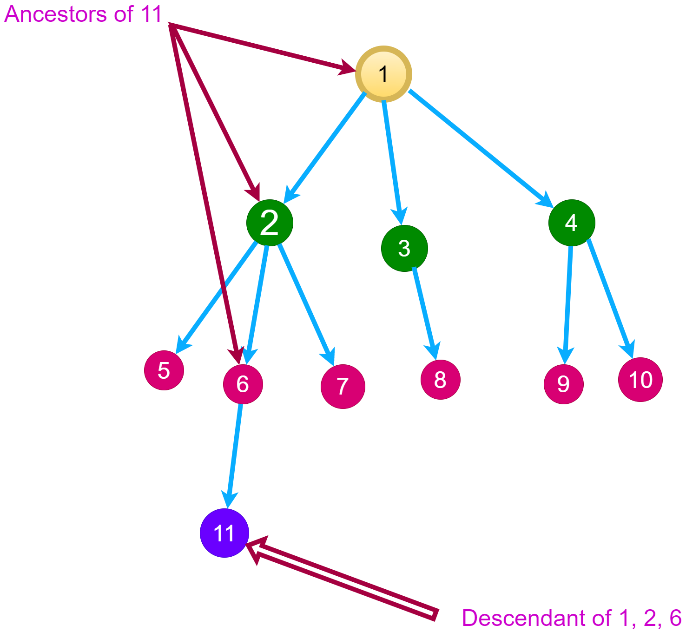
- ****Subtree****: Any node of the tree along with its descendant.
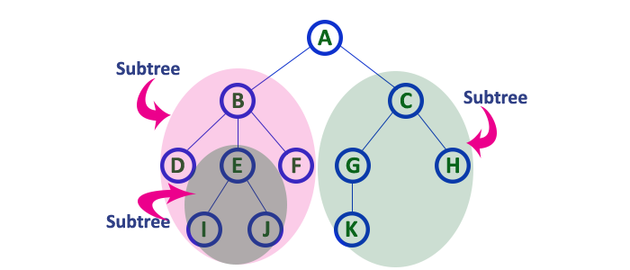
- ****Neighbor of a Node:**** Parent or child nodes of that node are called neighbors of that node.

### Types of Tree Data Structure

1. Binary Tree
   - Types of Binary Tree based on the number of children:
      1. Full Binary Tree => if every node has 0 or 2 children.
      2. Degenerate Binary Tree => A Tree where every internal node has one child. Such trees are performance-wise same as linked list.
      3. Skewed Binary Trees => is a pathological/degenerate tree in which the tree is either dominated by the left nodes or the right nodes.
         - left-skewed binary tree
         - right-skewed binary tree
   - Types of Binary Tree On the basis of the completion of levels:
      1. Complete Binary Tree => if all the levels are completely filled except possibly the last level and the last level has all keys as left as possible.
      2. Perfect Binary Tree => which all the internal nodes have two children and all leaf nodes are at the same level.
      3. Balanced Binary Tree => the difference between the height of the left and the right subtree for each node is either 0 or 1.
   - Some Special Types of Trees:
      1. Binary Search Tree => the left child containing values less than the parent node and the right child containing values greater than the parent node.
      2. AVL Tree => is a self-balancing Binary Search Tree (BST).
      3. Red Black Tree
      4. B Tree
      5. B+ Tree
      6. Segment Tree
2. Ternary Tree
3. N-ary Tree or Generic Tree

### Applications of Tree Data Structure

1. File System
2. Database Indexing
3. Data Compression
4. XML Parsing

---

### What is a Binary Search Tree(BST)?

A Binary Search Tree is a data structure used in computer science for organizing and storing data in a sorted manner. Each node in a Binary Search Tree has at most two children, a left child and a right child, with the left child containing values less than the parent node and the right child containing values greater than the parent node.

### How to handling duplicate values in the Binary Search Tree?

We must follow a consistent process throughout i.e. either store duplicate value at the left or store the duplicate value at the right of the root, but be consistent with your approach.

## Basic Operations on Binary Search Tree

1. Insertion
    - First step create new Node.
    - Initialize new pointer equal to root.
    - if tree is empty make root equal new node.
    - else check if data in this node less than data in new node move to the right subtree Otherwise, move to the left subtree.
    - Time Complexity
      - The worst-case time complexity of insert operations is O(h) where h is the height of the Binary Search Tree.
      - In the worst case, we may have to travel from the root to the deepest leaf node. The height of a skewed tree may become n and the time complexity of insertion operation may become O(n).
2. Binary Search Tree (BST) Traversals
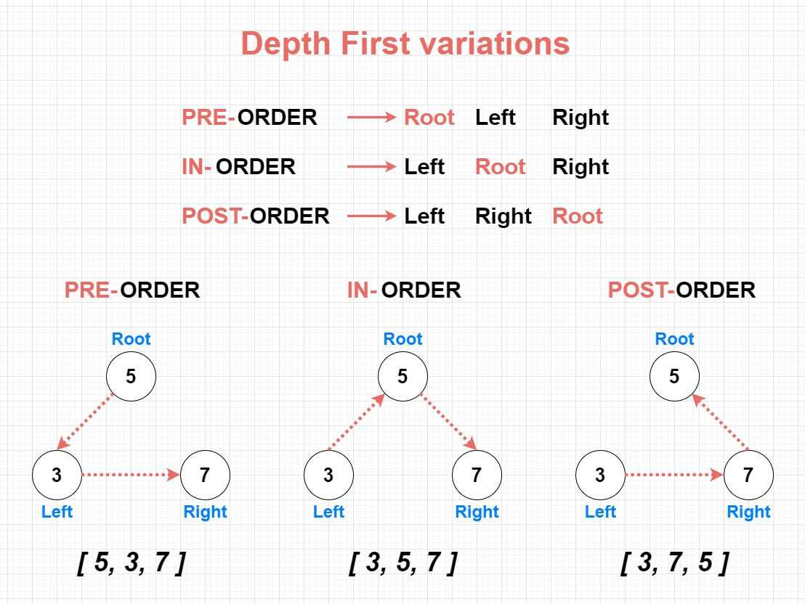 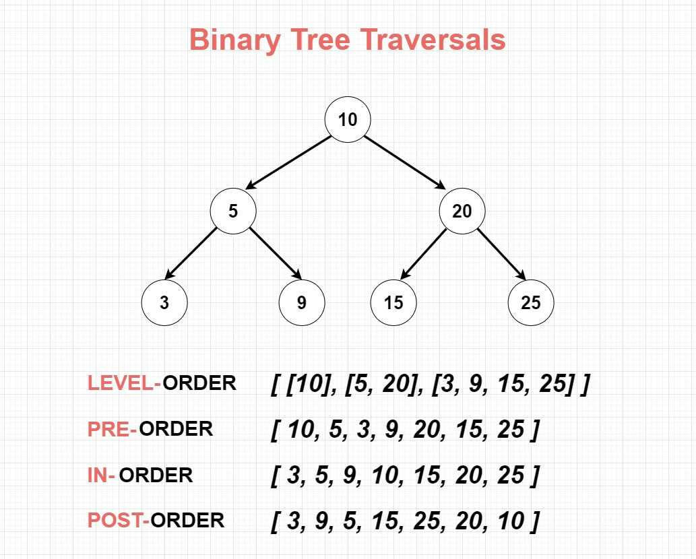
   1. Depth First Search or DFS
      1. Inorder Traversal
         - Create an empty stack (say S).
         - Initialize the current node as root.
         - Push the current node to S and set current = current->left until current is NULL.
         - If current is NULL and the stack is not empty then
         - Pop the top item from the stack.
         - Print the popped item and set current = popped_item->right
      2. Preorder Traversal
         - Create an empty stack (say S).
         - Initialize the current node as root.
         - Print the data then Push the current node to S and set current = current->left until current is NULL.
         - If current is NULL and the stack is not empty then
         - Pop the top item from the stack.
         - set current = popped_item->right
      3. Postorder Traversal
         - Create an two empty stacks (say S,S2).
         - Initialize the current node as root.
         - Push the current node to S and set current = current->left until current is NULL.
         - If current is NULL and the stack S is not empty then
         - check if S.top()->right NULL or S2 is not empty and S2.top() equal to temp node.
         - Pop the top item from the stack.
         - Print the popped item and set current = popped_item->right
         - else push the S1.top() in stack S2.
   2. Level Order Traversal or Breadth First Search or BFS
      - Create an empty Queue Q.
      - Enqueue the root node of the tree to Q
      - Loop while Q is not empty
      - Enqueue the left child of the dequeued node if it exists
      - Enqueue the right child of the dequeued node if it exists
      - Dequeue a node from Q and visit it

### Applications of Binary Search Tree (BST)

1. Searching: Finding a specific element in a sorted collection
2. Sorting: Sorting a collection of elements in ascending or descending order
3. Artificial intelligence: Decision trees and rule-based systems
